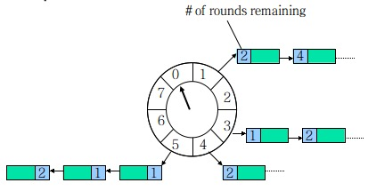
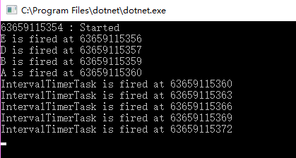

# High Performance Timer for .NET
HashedWheelTimer implemented in C# inspired by io.netty.util.HashedWheelTimer

## What is Hashed Wheel Timer?

It is a timer based on George Varghese and Tony Lauck's paper, [Hashed and Hierarchical Timing Wheels: data structures to efficiently implement a timer facility](http://cseweb.ucsd.edu/users/varghese/PAPERS/twheel.ps.Z). 



The concept on the Timer Wheel is rather simple to understand: in order to keep
track of events on given resolution, an array of linked lists (alternatively -
sets or even arrays, YMMV) is preallocated. When event is scheduled, it's
address is found by dividing deadline time `t` by `resolution` and `wheel size`.
The registration is then assigned with `rounds` (how many times we should go
around the wheel in order for the time period to be elapsed).

For each scheduled resolution, a __bucket__ is created. There are `wheel size`
buckets, each one of which is holding `Registrations`. Timer is going through
each `bucket` from the first until the next one, and decrements `rounds` for
each registration. As soon as registration's `rounds` is reaching 0, the timeout
is triggered. After that it is either rescheduled (with same `offset` and amount
of `rounds` as initially) or removed from timer.

Hashed Wheel is often called __approximated timer__, since it acts on the
certain resolution, which allows it's optimisations. All the tasks scheduled for
the timer period lower than the resolution or "between" resolution steps will be
rounded to the "ceiling" (for example, given resolution 10 milliseconds, all the
tasks for 5,6,7 etc milliseconds will first fire after 10, and 15, 16, 17 will
first trigger after 20).

If you're a visual person, it might be useful for you to check out [these
slides](http://www.cse.wustl.edu/~cdgill/courses/cs6874/TimingWheels.ppt),
which help to understand the concept underlying the Hashed Wheel Timer better.

## Why another Timer?

The .NET Framework and .NET Core already provide a set of timers

* `System.Timers.Timer`
* `System.Threading.Timer`
* `System.Windows.Forms.Timer`
* `System.Web.UI.Timer`
* `System.Windows.Threading.DispatcherTimer`

HashedWheelTimer is different as it is optimized for approximated I/O timeout scheduling. It provides __O(1) time complexity__ and cheap constant factors for the important operations of inserting or removing timers. It is a better choice in scenarios like more than ten thousands of active timers. 


## Installation

The package is available from NuGet
```
Install-Package HashedWheelTimer
```


## How to Use

First create an instance of `HashedWheelTimer` class.

Note that, each `HashedWheelTimer` instance creates a dedicated thread to watch the wheel. Hence, it is __strong recommanded__ to reuse `HashedWheelTimer` instance as much as possible.
```csharp
using HWT;

HashedWheelTimer timer = new HashedWheelTimer( tickDuration: TimeSpan.FromSeconds(1)
                , ticksPerWheel: 100000
                , maxPendingTimeouts: 0);
```

The constructor accepts the parameters below.

* `tickDuration` As described with 'approximated', this timer does not execute the scheduled TimerTask on time. HashedWheelTimer, on every tick, will check if there are any TimerTasks behind the schedule and execute them. You can increase or decrease the accuracy of the execution timing by specifying smaller or larger tick duration in the constructor. In most network applications, I/O timeout does not need to be accurate.
* `ticksPerWheel` HashedWheelTimer maintains a data structure called 'wheel'. To put simply, a wheel is a hash table of TimerTasks whose hash function is 'dead line of the task'. The default number of ticks per wheel (i.e. the size of the wheel) is 512. You could specify a larger value if you are going to schedule a lot of timeouts.
* `maxPendingTimeouts` The maximum number of pending timeouts after which call to _NewTimeout()_ will result in InvalidOperationException being thrown. No maximum pending timeouts limit is assumed if this value is 0 or negative.


Next, create a new class implementing `TimerTask` interface

```csharp
class MyTimerTask : TimerTask
{
    // This method is called when the task is expired.
    // It is fired via `Task.Run`, hence you'd better surround the code with try-catch
    public void Run(Timeout timeout)
    {
        try
        {
            // ...
        } catch(Exception){
            // ...
        }
    }
}
```

Now we can schedual the task in 5 seconds later.
```csharp
timer.NewTimeout(new MyTimerTask(), TimeSpan.FromSeconds(5));
```

Note that all the methods are __thread-safe__. You don't need synchronization on accessing them.


If you are using TPL(Task Parallel Library) asynchronous programming, you may already use `await Task.Delay(milliseconds)` to continue some work after a while. Alternatively, it can be replaced with following code if approximated delay is acceptable.

```csharp
await timer.Delay(milliseconds)`
```

## A full example

```csharp
/// <summary>
/// Task fired repeatedly
/// </summary>
class IntervalTimerTask : TimerTask
{
    public void Run(Timeout timeout)
    {
        Console.WriteLine($"IntervalTimerTask is fired at {DateTime.UtcNow.Ticks / 10000000L}");
        timeout.Timer.NewTimeout(this, TimeSpan.FromSeconds(2));
    }
}

/// <summary>
/// Task only be fired for one time
/// </summary>
class OneTimeTask : TimerTask
{
    readonly string _userData;
    public OneTimeTask(string data)
    {
        _userData = data;
    }

    public void Run(Timeout timeout)
    {
        Console.WriteLine($"{_userData} is fired at {DateTime.UtcNow.Ticks / 10000000L}");
    }
}


static void Main(string[] args)
{
    HashedWheelTimer timer = new HashedWheelTimer( tickDuration: TimeSpan.FromSeconds(1)
        , ticksPerWheel: 100000
        , maxPendingTimeouts: 0);

    timer.NewTimeout(new OneTimeTask("A"), TimeSpan.FromSeconds(5));
    timer.NewTimeout(new OneTimeTask("B"), TimeSpan.FromSeconds(4));
    var timeout = timer.NewTimeout(new OneTimeTask("C"), TimeSpan.FromSeconds(3));
    timer.NewTimeout(new OneTimeTask("D"), TimeSpan.FromSeconds(2));
    timer.NewTimeout(new OneTimeTask("E"), TimeSpan.FromSeconds(1));

    timeout.Cancel();

    timer.NewTimeout(new IntervalTimerTask(), TimeSpan.FromSeconds(5));
    Console.WriteLine($"{DateTime.UtcNow.Ticks / 10000000L} : Started");
    Console.ReadKey();
}
```

The output of the sample is something like
